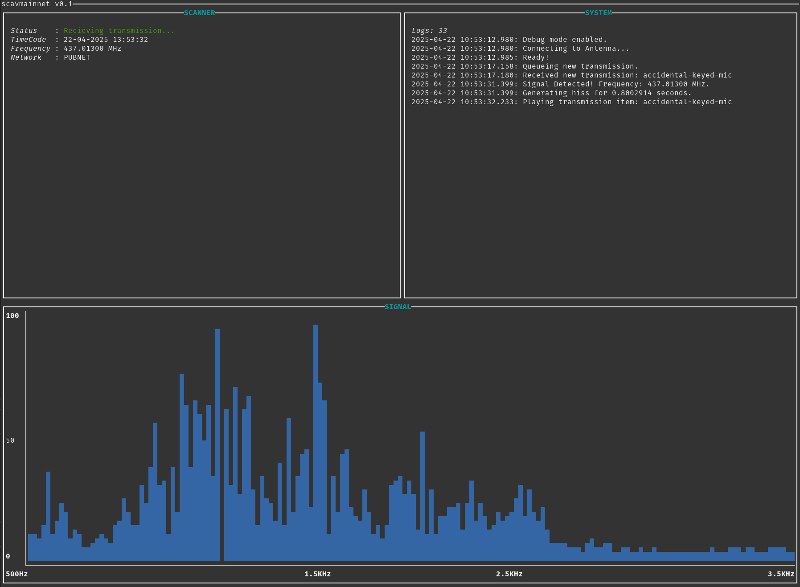

# scavnet : A storytelling tool

## Introduction
Scavnet is a tool for telling audio stories.

It simulates a scanner recieving radio transmissions, ordering and sequencing of a library of audio vingnettes, allowing stories to be told over variable timelines. It was originally conceieved as a method for unfolding dozens of classic radio dramas simultaneously over a period of time, but can be used to tell stories in a variety of ways.

## Development Status
This project is currently in **initial development**. While the core functionality is in place, additional features, optimizations, and improvements are being worked on. Contributions, feedback, and suggestions are welcome!

## Prerequisites
### Building From Source
As the project is currently in development, no binaries are currently being built for release. Consequently, you will need to install the Rust toolchain to run scavnet. You can do this by following the instructions at [rustup.rs](https://rustup.rs/).

### alsa.pc
 Ubuntu 20.04 or later:

```
sudo apt-get install libasound2-dev
```

## Configuration
** In-development, Incomplete documentation **

### Networks
Networks define the simulated frequency ranges that the application should simulate a scan across:

```
networks:
  -
    name: "pubnet"
    start_freq: 25000000
    end_freq: 512000000
    step: 1000
  -
    name: "scavnet"
    start_freq: 758000000
    end_freq: 824000000
    step: 1000
```

### Transmissions
Transmissions are the primary playback elements and defined as 'sets'.

## License
This project is dual-licensed under the GNU Affero General Public License v3 (AGPLv3) and a commercial license. You may use, modify, and distribute the software under the terms of the AGPLv3, which requires sharing source code for network-accessible applications. If you prefer to use this software under different terms—for example, in proprietary or commercial products—a commercial license is available. For details, see the [LICENSE.txt](LICENSE.txt) file 
